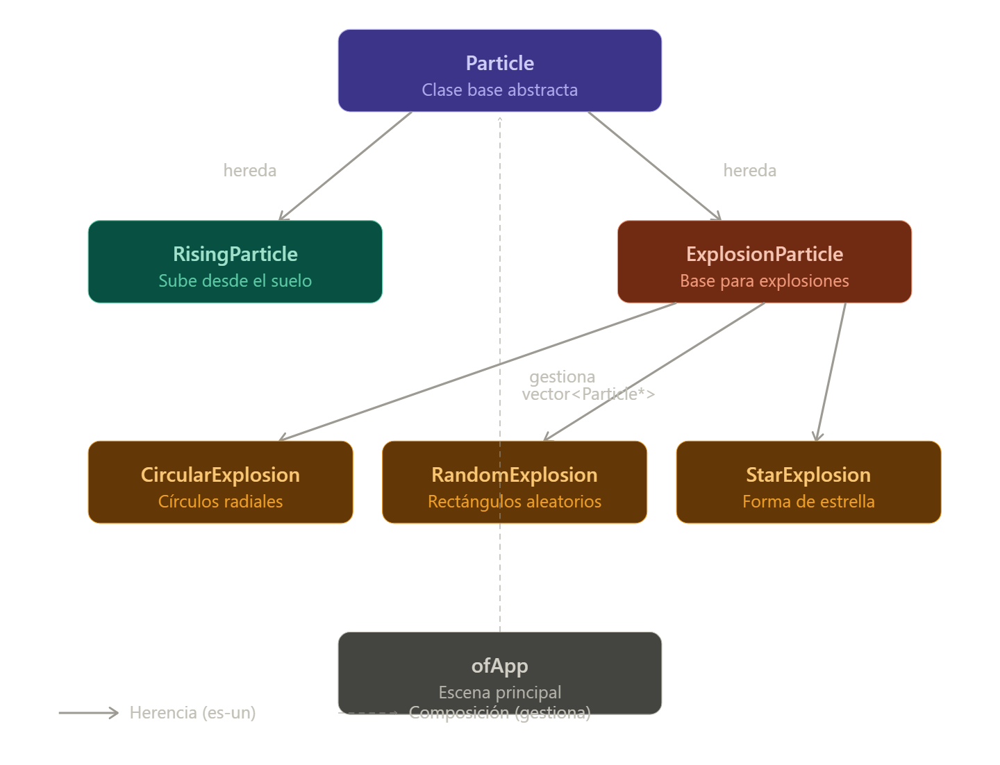

# Capturas del programa cuando lo ejecuté:

foto 1

# ¿Qué hace?
En mis palabras, el programa hace que con cada clic se creen unos fuegos artificiales que salen desde el fondo de la pantalla se mueven hacia arriba, despues estallan y por ultimo se desvanecen.

Hay 3 funciones: presionar s para tomar un screenshot, clic para detonar un cohete y espacio para detonar varios cohetes.

Todo el programa gira alrededor de la clase Particula, que es como un cohetico que se detona y explota de diferentes maneras random. Está programado como objeto:

atributos:
posicion
velocidad
color
tiempo max antes de explotar
edad
ha explotado o no    
				glm::vec2 velocity;    
				ofColor color;    
				float lifetime; 
				// tiempo máximo antes de explotar    
				float age;    
				bool exploded;

métodos:
dibujar
morir/desvanecer
explotar

Yo diria que explotar es un comportamiento del objeto Particula, hay 3 tipos de explosiones: circulo, random y estrella. Son escogidas al random.

Para que la particula explote, el programa tiene en cuenta cuanto tiempo lleva existiendo o si la particula alcanza cierta altura.

```cpp
void ofApp::update() {    
		float dt = ofGetLastFrameTime(); 
    for (int i = 0; i < particles.size(); i++) {        
		    particles[i]->update(dt);    
		    }
    for (int i = particles.size() - 1; i >= 0; i--) {        
    
		    if (particles[i]->shouldExplode()) {            
				    int explosionType = (int)ofRandom(3); 
```




este diagrama muestra como esta organizado el programa

