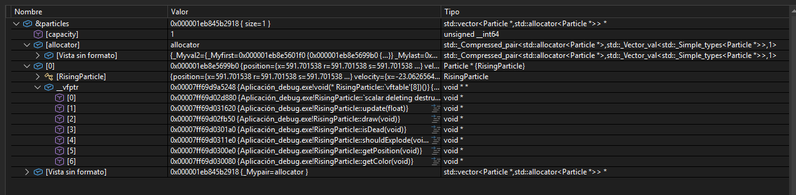
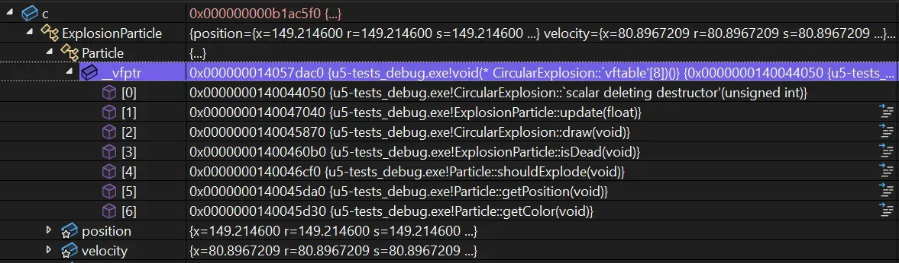
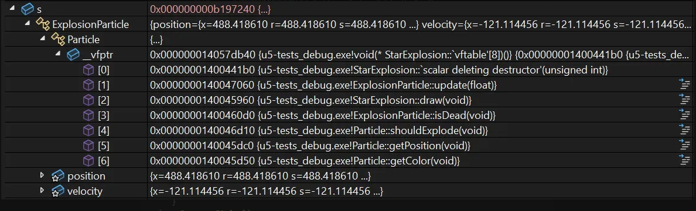

# Actividad 3

Experimento: Redescubrir conceptos teóricos en la práctica utilizando el depurador de código para entender como funcionan dentro del programa.

**Concepto de objeto:** el objeto es una instancia (copia) de una clase, la clase define un tipo de objeto, pero no es el objeto en si mismo, ¿Como se ve el objeto en la memoria?

1. Hipótesis: En la memoria espero ver que el objeto tiene una dirección de memoria de la instancia dentro del arreglo particles, con los mismos atributos y métodos de la clase, excepto que este objeto solo existe mientras el programa esta ejecutandose.

**Resultado:**

Crear rising particle:

En el depurador aparece el arreglo particles* es decir un arreglo de punteros los cuales son direcciones de memoria y cada uno apunta hacia un objeto para que tenga comportamientos diferentes (polimorfico)

2. En el Circular explotion se ve una jerarquía de herencia que es asi: la clase abstracta Particle, de la cual hereda ExplotionParticle y de esta CircularExplotion, es decir esta compuesta por capas anidadas. Además de esto, tiene sus métodos que han sido heredados de diferentes clases:

ExplotionParticle: update, isDead
Particle: shouldExplote, getPosition, getColor
CircularExplotion: draw

En cuanto a StarExplotion aplica lo mismo excepto que su draw es un comportamiento propio, es decir que el metodo para dibujarla es diferente al del circularexplotion.

## Conclusión

El polimorfismo es posible gracias a la tabla virtual al momento de ejecución, ya que permite que la clase virtual Particle tenga el método draw() pero en los objetos reales tienen comportamientos diferentes dependiendo del tipo de objeto.