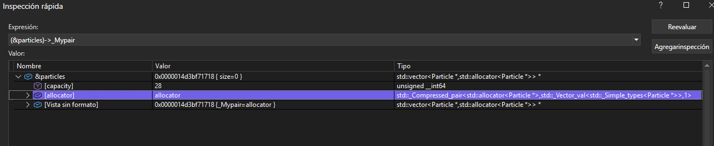

# Actividad 3

Experimento: Redescubrir conceptos teóricos en la práctica utilizando el depurador de código para entender como funcionan dentro del programa.

**Concepto de objeto:** el objeto es una instancia (copia) de una clase, la clase define un tio de objeto, pero no es el objeto en si mismo, ¿Como se ve el objeto en la memoria?

1. Hipótesis: En la memoria espero ver que el objeto tiene una dirección de memoria de la instancia dentro del arrego particles, con los mismos atributos de la clase (pos, vel, col, lifetime), excepto que este objeto solo existe mientras el programa esta ejecutandose.

**Resultado:**

