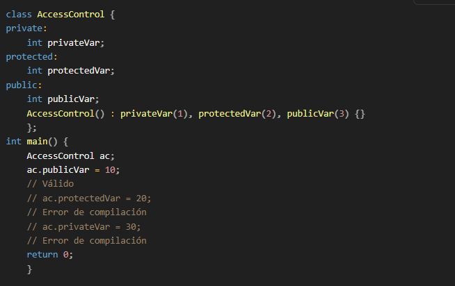
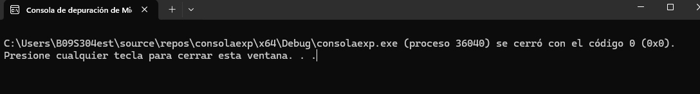
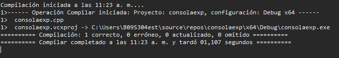
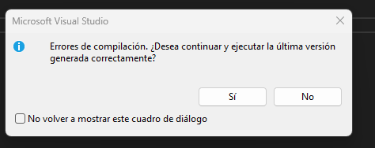
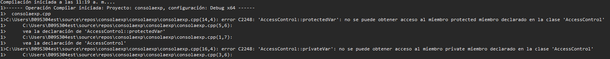

# Actividad 4

**Concepto de encapsulamiento:** crear un proyecto consola de c++ en visual studio:

Ejecutar:

descomenta las lineas que estan comentadas y vuelve a compilar:

Sale un error de compilación porque no tiene acceso a la clase entonces no puede modificar el valor en las líneas:
ac.protectedVar = 20; 
ac.privateVar = 30; 

**¿Por qué sucede?**
Esto sucede porque los diferentes modificadores de acceso no permiten que el programa compile, en el publicVar el programa tiene acceso, en protected solo tiene acceso la misma clase y las clases que heredan de esta, y por último private solo puede acceder la misma clase.

**Conclusión:**
A partir de esto yo concluyo que el encapsulamiento es importante por dos cosas: protección de datos y controla el acceso, esto es importante para evitar que se cambien valores accidentalmente o que clases accedan a datos que no deben y se confundan con otros valores y asi entorpezcan el código.