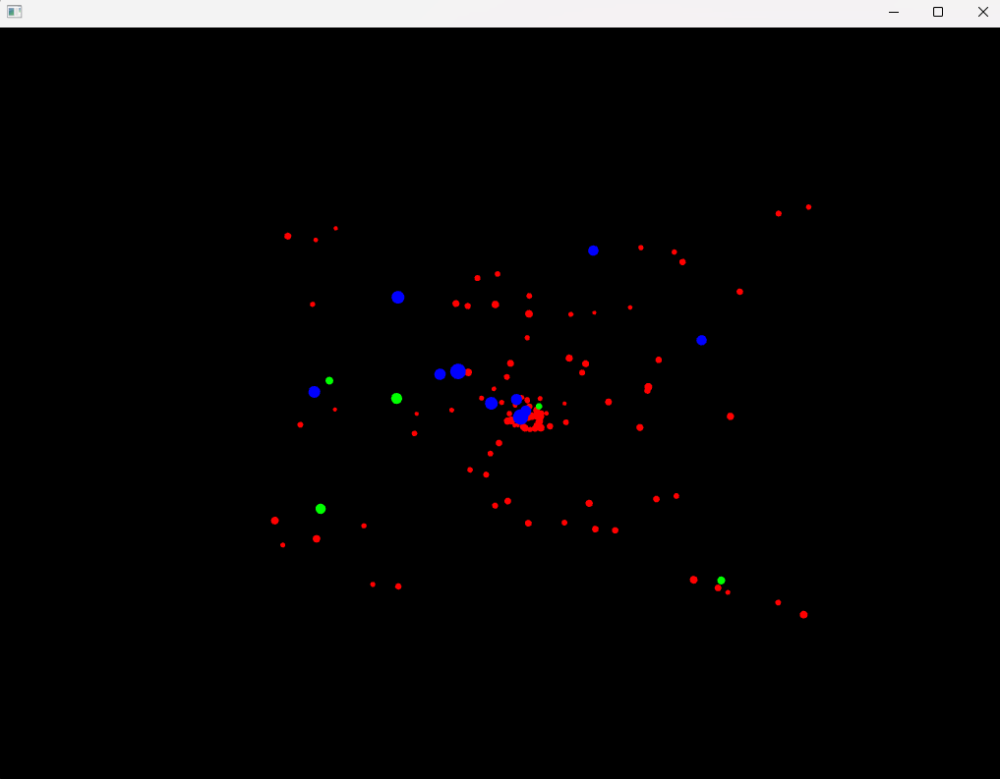
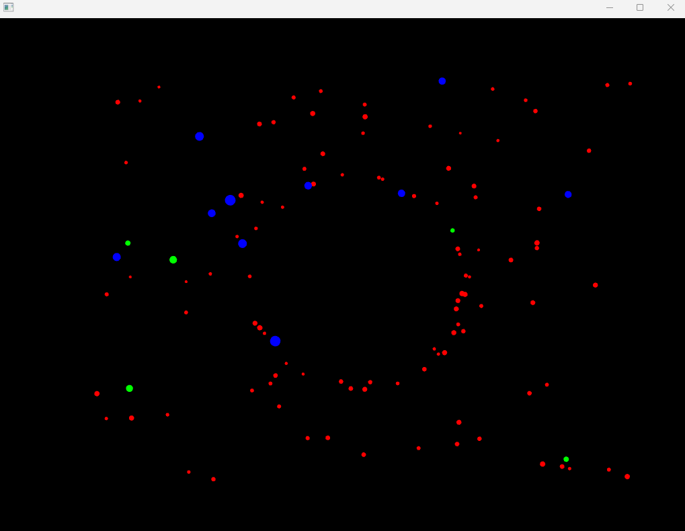
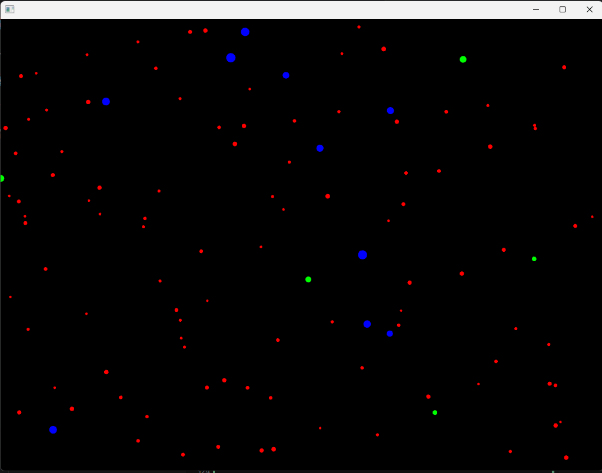

# 🧐🧪✍️ Reporta en tu bitácora
1. ¿Cómo puedes interactuar con la aplicación? Menciona específicamente las teclas y qué efecto parecen tener sobre las partículas.

r/ Puedes presionar las teclas a, s. r y n para cambiar el comportamiento de las particulas. 

a: atrae todas las particulas hacia el mouse

s: hace que las particulas se detengan

r: repele las particulas del mouse

n: las particulas se mueven de manera independiente

2. ¿Observas los diferentes tipos de “partículas”? ¿Se comportan todas igual inicialmente?

r/ La principal diferencia que logro observar al ejecutar el programa es que las verdes(estrellas fugaces) tienen la mayor velocidad, seguidas por las rojas(estrellas) y las mas lentas son las azules (planetas)

3. Toma algunas capturas de pantalla de la aplicación en diferentes momentos (estado inicial, después de presionar ‘a’, ‘r’, ‘s’, ‘n’) y añádelas a tu bitácora.

a

r

n

4. ¿Qué crees que está pasando “detrás de cámaras” cuando presionas las teclas? Formula una hipótesis inicial sobre cómo la aplicación cambia el comportamiento de las partículas.

r/ En el detrás de cámaras al presionar las teclas, todas las particulas al crearse fueron almacenadas en un arreglo que la clase observer tiene acceso para realizar la funcion notify y asi asegurarse de los cambios de comportamiento de las particulas sean ejecutados.