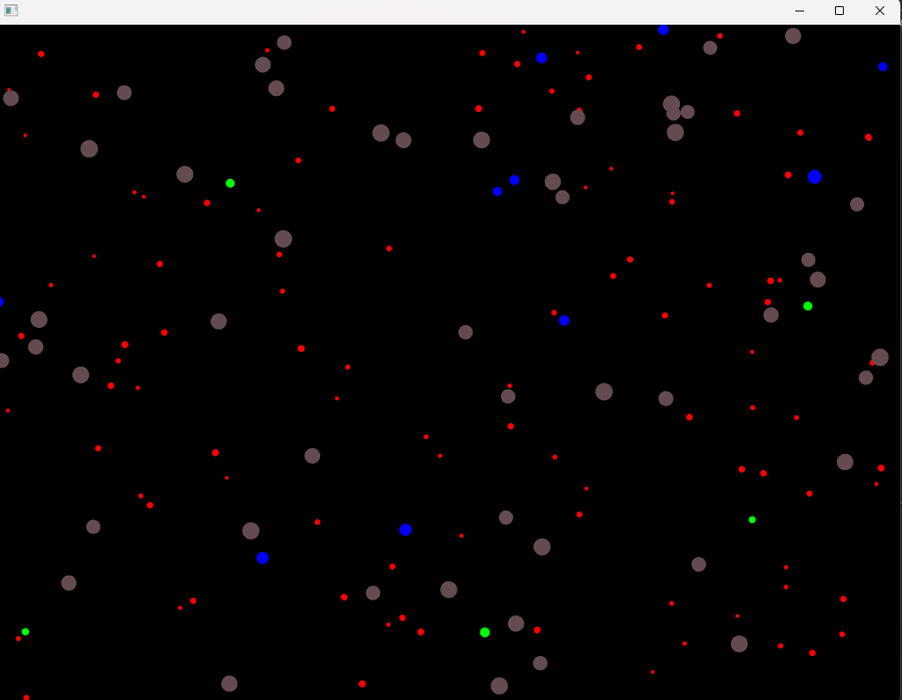

# Actividad 5
En esta actividad modificarás el caso de estudio para añadir un nuevo tipo de partícula que utiliza los patrones Observer, Factory y State.

# 🧐🧪✍️ Reporta en tu bitácora**
1. El código fuente completo de tu proyecto openFrameworks.
2. Explica cómo usaste el patrón Factory para esta nueva partícula.
3. Describe cómo implementaste el patrón Observer para esta nueva partícula.
4. Explica cómo aplicaste el patrón State a esta nueva partícula.

