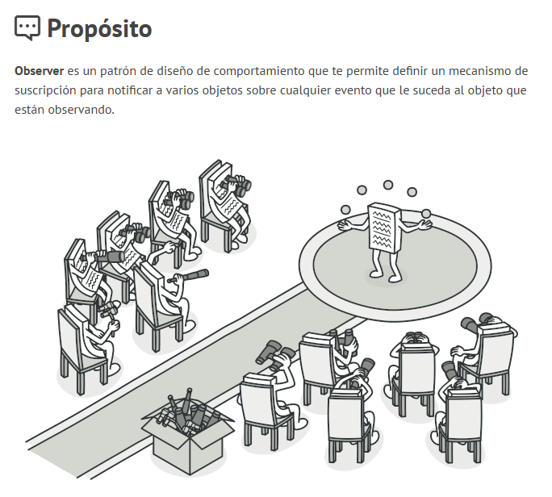

# Actividad 2: Investiga el patrón observer



1. **Identifica los Roles:**
    - ¿Qué clase actúa como la interfaz `Observer`? ¿Qué método define?

    r/ La clase Observer funciona como interfaz, ya que sus métodos no se implementan en la clase, sino en las que heredan de esta. Y además define el método onNotify

    ````cpp
    virtual void onNotify(const std::string & event) = 0;
    ````

    - ¿Qué clase actúa como `Subject`? ¿Qué métodos proporciona para gestionar observadores y notificar?

    r/La clase Subject proporciona los métodos addObserver, removeObserver para gestionar observadores y para notificar sobreescribe el método virtual que se define en Observer onNotify.

    - ¿Qué clase es el `ConcreteSubject` en esta aplicación? ¿Por qué? (Pista: ¿Quién *envía* las notificaciones?)

    r/ La clase ofApp es la que controla todo, porque hereda de Subject y se encarga de avisarle a las partículas lo que pasa. Por ejemplo, en keyPressed detecta qué tecla se presionó y llama a notify() con ese evento. Además, en setup() registra cada Particle con addObserver(p). En resumen, es la que recibe las acciones del usuario y se las pasa a todas las partículas.

    - ¿Qué clase(s) actúan como `ConcreteObserver`? ¿Por qué? (Pista: ¿Quién *recibe* y *reacciona* a las notificaciones?)

    r/ Particle porque hereda de Observer y es la que implementa onNotify, donde reacciona a los eventos. Cuando ofApp manda una notificación, cada Particle la recibe y cambia su estado con setState. Básicamente, es la que escucha y responde a lo que pasa.

2. **Sigue el flujo de notificación:**
    - Localiza el método `keyPressed` en `ofApp.cpp`. ¿Qué sucede cuando se presiona la tecla ‘a’? ¿Qué método se llama?

r/ Cuando se presiona la tecla a, el método keyPressed de ofApp llama a notify, ese método usa el vector de observers y le manda la instrucción a cada partícula registrada. Dentro de onNotify, la partícula revisa que el evento sea "attract" y entonces cambia su estado con setState, reemplazando el que tenía antes.

    - Ve al método `notify` en la clase `Subject`. ¿Qué hace este método?

r/ Lee la lista de observers y le llama onNotify a cada uno, enviándoles el evento como un string. En otras palabras, se encarga de repartir el mensaje a todos los suscritos, sin importar quiénes son ni qué hagan con él.

    - Localiza el método que implementa la interfaz `Observer` en la clase `Particle` (`onNotify`). ¿Qué hace este método cuando recibe el evento “attract”?

    r/ 
    
3. **Registro y eliminación de observadores:**
    - ¿En qué parte del código se añaden las instancias de `Particle` como observadores de `ofApp`? (Busca dónde se llama a `addObserver`).
    - Aunque no se usa explícitamente en este ejemplo simple, ¿Dónde se eliminarían los observadores si fuera necesario (por ejemplo, si una partícula se destruyera durante la ejecución)? (Busca `removeObserver`). ¿Por qué es importante el destructor de `ofApp` en este contexto?

   #  🧐🧪✍️ Reporta en tu bitácora
1. Explica con tus propias palabras el propósito del patrón Observer. ¿Qué problema resuelve?
2. Dibuja un diagrama que muestre la relación entre Subject, Observer, ofApp y Particle en el caso de estudio, indicando quién es el Sujeto y quiénes los Observadores.
3. Construye un diagrama de secuencia que muestre cómo funciona el patrón Observer al presionar una tecla.
4. ¿Qué ventajas crees que ofrece usar el patrón Observer en esta aplicación en comparación con, por ejemplo, que ofApp::update recorriera todas las partículas y les dijera directamente que cambien su comportamiento basado en una variable global? Piensa en términos de acoplamiento y extensibilidad.