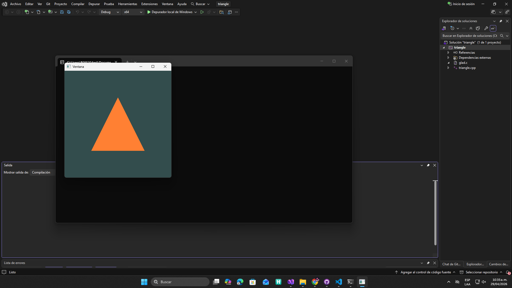

# **Actividad 1**

# **Orientación y primer vistazo al entorno gráfico**

**🎯 Enunciado**
En esta actividad vas a descargar y ejecutar un ejemplo básico introductorio a OpenGL. La idea de esta actividad es solo que pongas a funcionar el ejemplo. No es necesario que entiendas el código en este momento, pero sí que observes de manera general el programa. En la fase de investigación vas a profundizar en el código y en los conceptos de OpenGL.

**Ejemplo simple de un triángulo en OpenGL:**

1. Abre y explora el programa:
- Descarga el proyecto que está en [este repositorio de GitHub](https://github.com/juanferfranco/triangle)
- Descomprime y abre el archivo de solución (`.sln`) de Visual Studio proporcionado.
- Observa la estructura del proyecto en el Explorador de Soluciones e identifica el archivo de C++ `.cpp`.
1. Compila y ejecuta el ejemplo

**🧐🧪✍️ Reporta en tu bitácora**
1. Incluye una captura de pantalla del ejemplo funcionando en tu máquina.

2. Observa el proyecto, trata de entenderlo, pero ten presente que lo analizaremos más adelante.

r/ Es un triángulo hecho en un programa de OpenGL, el cual es un lenguaje qu permite programar dentro de la gpu, para tener más control dentro de lo que el computador renderiza.

3. ¿Qué preguntas te surgen al ver el código? Anota al menos tres preguntas que te gustaría investigar más adelante (no te preocupes que la idea de esta unidad es que las resuelvas).

- ¿Qué utilidad tiene programar desde la gpu?
- ¿Por qué necesito configurar las librerías dentro del programa? Si descargo las librerías y las guardo en la carpeta de external, ya deberían incluirse
- ¿Profe por que me tiene la mala?
- ¿ Para que sirve la libreria glad?